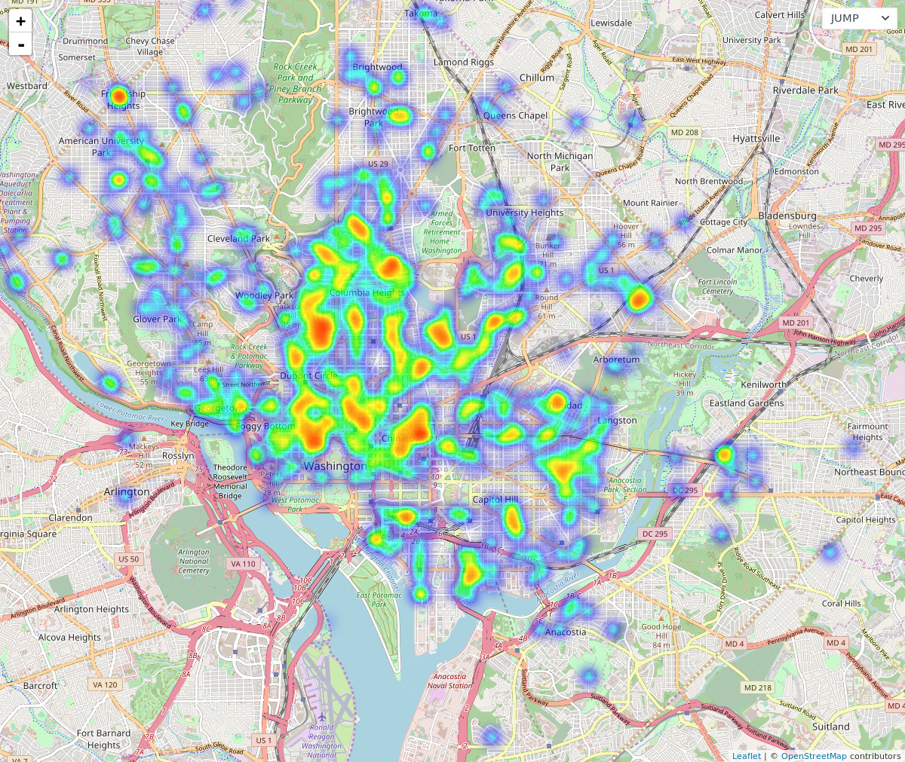

BikeHero Labs is a place for building even smaller bike & bikeshare expirements than
[bikehero.io](https://bikehero.io) and [share.bikehero.io](https://share.bikehero.io)

### Lab projects include:
 * [Heatmaps of dockless bikes](https://labs.bikehero.io/heatmap)
   
 * [A GBFS to GeoJSON Proxy](https://gbfs2geojson.glitch.me/)

### About
BikeHero and BikeHero Labs are projects by Daniel Schep:
 * [🐦 @schep_](https://twitter.com/schep_)
 * [{} dschep](https://github.com/dschep)
 * [🌐 schep.me](https://schep.me)
