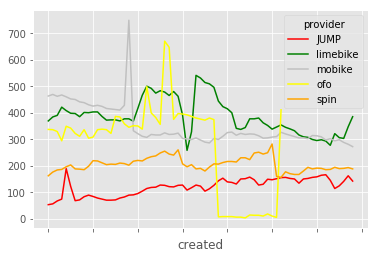

```python
!pip install records boto3 psycopg2-binary pandas
```

    Requirement already satisfied: records in /home/dschep/.virtualenvs/dobi-analysis-IoBVmdSu/lib/python3.6/site-packages (0.5.2)
    Requirement already satisfied: boto3 in /home/dschep/.virtualenvs/dobi-analysis-IoBVmdSu/lib/python3.6/site-packages (1.7.10)
    Requirement already satisfied: psycopg2-binary in /home/dschep/.virtualenvs/dobi-analysis-IoBVmdSu/lib/python3.6/site-packages (2.7.4)
    Requirement already satisfied: pandas in /home/dschep/.virtualenvs/dobi-analysis-IoBVmdSu/lib/python3.6/site-packages (0.22.0)
    Requirement already satisfied: tablib in /home/dschep/.virtualenvs/dobi-analysis-IoBVmdSu/lib/python3.6/site-packages (from records) (0.12.1)
    Requirement already satisfied: docopt in /home/dschep/.virtualenvs/dobi-analysis-IoBVmdSu/lib/python3.6/site-packages (from records) (0.6.2)
    Requirement already satisfied: SQLAlchemy in /home/dschep/.virtualenvs/dobi-analysis-IoBVmdSu/lib/python3.6/site-packages (from records) (1.2.7)
    Requirement already satisfied: botocore<1.11.0,>=1.10.10 in /home/dschep/.virtualenvs/dobi-analysis-IoBVmdSu/lib/python3.6/site-packages (from boto3) (1.10.10)
    Requirement already satisfied: jmespath<1.0.0,>=0.7.1 in /home/dschep/.virtualenvs/dobi-analysis-IoBVmdSu/lib/python3.6/site-packages (from boto3) (0.9.3)
    Requirement already satisfied: s3transfer<0.2.0,>=0.1.10 in /home/dschep/.virtualenvs/dobi-analysis-IoBVmdSu/lib/python3.6/site-packages (from boto3) (0.1.13)
    Requirement already satisfied: numpy>=1.9.0 in /home/dschep/.virtualenvs/dobi-analysis-IoBVmdSu/lib/python3.6/site-packages (from pandas) (1.14.2)
    Requirement already satisfied: pytz>=2011k in /home/dschep/.virtualenvs/dobi-analysis-IoBVmdSu/lib/python3.6/site-packages (from pandas) (2018.4)
    Requirement already satisfied: python-dateutil>=2 in /home/dschep/.virtualenvs/dobi-analysis-IoBVmdSu/lib/python3.6/site-packages (from pandas) (2.7.2)
    Requirement already satisfied: openpyxl in /home/dschep/.virtualenvs/dobi-analysis-IoBVmdSu/lib/python3.6/site-packages (from tablib->records) (2.5.3)
    Requirement already satisfied: xlrd in /home/dschep/.virtualenvs/dobi-analysis-IoBVmdSu/lib/python3.6/site-packages (from tablib->records) (1.1.0)
    Requirement already satisfied: unicodecsv in /home/dschep/.virtualenvs/dobi-analysis-IoBVmdSu/lib/python3.6/site-packages (from tablib->records) (0.14.1)
    Requirement already satisfied: odfpy in /home/dschep/.virtualenvs/dobi-analysis-IoBVmdSu/lib/python3.6/site-packages (from tablib->records) (1.3.6)
    Requirement already satisfied: pyyaml in /home/dschep/.virtualenvs/dobi-analysis-IoBVmdSu/lib/python3.6/site-packages (from tablib->records) (3.12)
    Requirement already satisfied: xlwt in /home/dschep/.virtualenvs/dobi-analysis-IoBVmdSu/lib/python3.6/site-packages (from tablib->records) (1.3.0)
    Requirement already satisfied: docutils>=0.10 in /home/dschep/.virtualenvs/dobi-analysis-IoBVmdSu/lib/python3.6/site-packages (from botocore<1.11.0,>=1.10.10->boto3) (0.14)
    Requirement already satisfied: six>=1.5 in /home/dschep/.virtualenvs/dobi-analysis-IoBVmdSu/lib/python3.6/site-packages (from python-dateutil>=2->pandas) (1.11.0)
    Requirement already satisfied: jdcal in /home/dschep/.virtualenvs/dobi-analysis-IoBVmdSu/lib/python3.6/site-packages (from openpyxl->tablib->records) (1.4)
    Requirement already satisfied: et-xmlfile in /home/dschep/.virtualenvs/dobi-analysis-IoBVmdSu/lib/python3.6/site-packages (from openpyxl->tablib->records) (1.0.1)


```python
import boto3
import records
from matplotlib import style
%matplotlib inline
style.use('ggplot')
```


```python
db_url = boto3.client('ssm').get_parameter(Name='/bikefinder/dev/db_url', WithDecryption=True)['Parameter']['Value']
db = records.Database(db_url)
```


```python
# number of bikes in operaton per day per provider
bikes_in_service = db.query(
    """
    ( -- number of unique bike_ids per provider (except ofo)
      select created::date, provider, count(distinct bike_id) num_bikes
      from bike_locations
      where provider<>'ofo'
      group by provider, created::date
    )
    union
    ( -- max number of ofo bikes available through out the day
      with ofo as (select * from bike_locations where provider='ofo'),
        counts_per_batch as (select count(bike_id), bike_id, created::date from ofo
                             group by bike_id, created::date)
      select created, 'ofo' provider, max("count") num_bikes
      from counts_per_batch
      group by created
    )
    order by created, provider;
    """).export('df')
bikes_in_service = bikes_in_service.pivot(index='created', columns='provider', values='num_bikes')
```


```python
bikes_in_service
```


<div>
<style scoped>
    .dataframe tbody tr th:only-of-type {
        vertical-align: middle;
    }

    .dataframe tbody tr th {
        vertical-align: top;
    }

    .dataframe thead th {
        text-align: right;
    }
</style>
<table border="1" class="dataframe">
  <thead>
    <tr style="text-align: right;">
      <th>provider</th>
      <th>JUMP</th>
      <th>limebike</th>
      <th>mobike</th>
      <th>ofo</th>
      <th>spin</th>
    </tr>
    <tr>
      <th>created</th>
      <th></th>
      <th></th>
      <th></th>
      <th></th>
      <th></th>
    </tr>
  </thead>
  <tbody>
    <tr>
      <th>2018-02-18</th>
      <td>54.0</td>
      <td>370.0</td>
      <td>464.0</td>
      <td>338.0</td>
      <td>163.0</td>
    </tr>
    <tr>
      <th>2018-02-19</th>
      <td>57.0</td>
      <td>385.0</td>
      <td>470.0</td>
      <td>337.0</td>
      <td>177.0</td>
    </tr>
    <tr>
      <th>2018-02-20</th>
      <td>68.0</td>
      <td>391.0</td>
      <td>463.0</td>
      <td>330.0</td>
      <td>185.0</td>
    </tr>
    <tr>
      <th>2018-02-21</th>
      <td>75.0</td>
      <td>422.0</td>
      <td>468.0</td>
      <td>295.0</td>
      <td>187.0</td>
    </tr>
    <tr>
      <th>2018-02-22</th>
      <td>190.0</td>
      <td>409.0</td>
      <td>461.0</td>
      <td>350.0</td>
      <td>197.0</td>
    </tr>
    <tr>
      <th>2018-02-23</th>
      <td>123.0</td>
      <td>399.0</td>
      <td>453.0</td>
      <td>343.0</td>
      <td>204.0</td>
    </tr>
    <tr>
      <th>2018-02-24</th>
      <td>69.0</td>
      <td>398.0</td>
      <td>451.0</td>
      <td>323.0</td>
      <td>189.0</td>
    </tr>
    <tr>
      <th>2018-02-25</th>
      <td>72.0</td>
      <td>386.0</td>
      <td>442.0</td>
      <td>312.0</td>
      <td>188.0</td>
    </tr>
    <tr>
      <th>2018-02-26</th>
      <td>84.0</td>
      <td>402.0</td>
      <td>439.0</td>
      <td>337.0</td>
      <td>186.0</td>
    </tr>
    <tr>
      <th>2018-02-27</th>
      <td>90.0</td>
      <td>401.0</td>
      <td>431.0</td>
      <td>305.0</td>
      <td>199.0</td>
    </tr>
    <tr>
      <th>2018-02-28</th>
      <td>85.0</td>
      <td>404.0</td>
      <td>426.0</td>
      <td>309.0</td>
      <td>220.0</td>
    </tr>
    <tr>
      <th>2018-03-01</th>
      <td>79.0</td>
      <td>404.0</td>
      <td>429.0</td>
      <td>337.0</td>
      <td>219.0</td>
    </tr>
    <tr>
      <th>2018-03-02</th>
      <td>75.0</td>
      <td>387.0</td>
      <td>425.0</td>
      <td>339.0</td>
      <td>212.0</td>
    </tr>
    <tr>
      <th>2018-03-03</th>
      <td>71.0</td>
      <td>373.0</td>
      <td>417.0</td>
      <td>337.0</td>
      <td>205.0</td>
    </tr>
    <tr>
      <th>2018-03-04</th>
      <td>71.0</td>
      <td>374.0</td>
      <td>415.0</td>
      <td>323.0</td>
      <td>207.0</td>
    </tr>
    <tr>
      <th>2018-03-05</th>
      <td>72.0</td>
      <td>374.0</td>
      <td>413.0</td>
      <td>387.0</td>
      <td>206.0</td>
    </tr>
    <tr>
      <th>2018-03-06</th>
      <td>79.0</td>
      <td>370.0</td>
      <td>411.0</td>
      <td>385.0</td>
      <td>211.0</td>
    </tr>
    <tr>
      <th>2018-03-07</th>
      <td>83.0</td>
      <td>378.0</td>
      <td>429.0</td>
      <td>359.0</td>
      <td>209.0</td>
    </tr>
    <tr>
      <th>2018-03-08</th>
      <td>90.0</td>
      <td>378.0</td>
      <td>750.0</td>
      <td>346.0</td>
      <td>203.0</td>
    </tr>
    <tr>
      <th>2018-03-09</th>
      <td>91.0</td>
      <td>369.0</td>
      <td>333.0</td>
      <td>352.0</td>
      <td>218.0</td>
    </tr>
    <tr>
      <th>2018-03-10</th>
      <td>96.0</td>
      <td>417.0</td>
      <td>322.0</td>
      <td>351.0</td>
      <td>221.0</td>
    </tr>
    <tr>
      <th>2018-03-11</th>
      <td>105.0</td>
      <td>467.0</td>
      <td>312.0</td>
      <td>339.0</td>
      <td>219.0</td>
    </tr>
    <tr>
      <th>2018-03-12</th>
      <td>115.0</td>
      <td>501.0</td>
      <td>308.0</td>
      <td>500.0</td>
      <td>229.0</td>
    </tr>
    <tr>
      <th>2018-03-13</th>
      <td>119.0</td>
      <td>493.0</td>
      <td>319.0</td>
      <td>400.0</td>
      <td>235.0</td>
    </tr>
    <tr>
      <th>2018-03-14</th>
      <td>120.0</td>
      <td>475.0</td>
      <td>317.0</td>
      <td>383.0</td>
      <td>238.0</td>
    </tr>
    <tr>
      <th>2018-03-15</th>
      <td>128.0</td>
      <td>484.0</td>
      <td>317.0</td>
      <td>357.0</td>
      <td>249.0</td>
    </tr>
    <tr>
      <th>2018-03-16</th>
      <td>127.0</td>
      <td>479.0</td>
      <td>325.0</td>
      <td>671.0</td>
      <td>256.0</td>
    </tr>
    <tr>
      <th>2018-03-17</th>
      <td>122.0</td>
      <td>466.0</td>
      <td>319.0</td>
      <td>648.0</td>
      <td>245.0</td>
    </tr>
    <tr>
      <th>2018-03-18</th>
      <td>121.0</td>
      <td>481.0</td>
      <td>320.0</td>
      <td>376.0</td>
      <td>241.0</td>
    </tr>
    <tr>
      <th>2018-03-19</th>
      <td>127.0</td>
      <td>463.0</td>
      <td>324.0</td>
      <td>398.0</td>
      <td>261.0</td>
    </tr>
    <tr>
      <th>...</th>
      <td>...</td>
      <td>...</td>
      <td>...</td>
      <td>...</td>
      <td>...</td>
    </tr>
    <tr>
      <th>2018-03-29</th>
      <td>154.0</td>
      <td>424.0</td>
      <td>312.0</td>
      <td>9.0</td>
      <td>213.0</td>
    </tr>
    <tr>
      <th>2018-03-30</th>
      <td>140.0</td>
      <td>416.0</td>
      <td>326.0</td>
      <td>9.0</td>
      <td>217.0</td>
    </tr>
    <tr>
      <th>2018-03-31</th>
      <td>138.0</td>
      <td>401.0</td>
      <td>328.0</td>
      <td>9.0</td>
      <td>217.0</td>
    </tr>
    <tr>
      <th>2018-04-01</th>
      <td>132.0</td>
      <td>342.0</td>
      <td>316.0</td>
      <td>7.0</td>
      <td>215.0</td>
    </tr>
    <tr>
      <th>2018-04-02</th>
      <td>151.0</td>
      <td>338.0</td>
      <td>323.0</td>
      <td>7.0</td>
      <td>231.0</td>
    </tr>
    <tr>
      <th>2018-04-03</th>
      <td>152.0</td>
      <td>345.0</td>
      <td>319.0</td>
      <td>4.0</td>
      <td>231.0</td>
    </tr>
    <tr>
      <th>2018-04-04</th>
      <td>158.0</td>
      <td>378.0</td>
      <td>321.0</td>
      <td>15.0</td>
      <td>224.0</td>
    </tr>
    <tr>
      <th>2018-04-05</th>
      <td>148.0</td>
      <td>378.0</td>
      <td>320.0</td>
      <td>14.0</td>
      <td>249.0</td>
    </tr>
    <tr>
      <th>2018-04-06</th>
      <td>128.0</td>
      <td>381.0</td>
      <td>314.0</td>
      <td>14.0</td>
      <td>252.0</td>
    </tr>
    <tr>
      <th>2018-04-07</th>
      <td>131.0</td>
      <td>363.0</td>
      <td>305.0</td>
      <td>11.0</td>
      <td>245.0</td>
    </tr>
    <tr>
      <th>2018-04-08</th>
      <td>150.0</td>
      <td>353.0</td>
      <td>306.0</td>
      <td>19.0</td>
      <td>250.0</td>
    </tr>
    <tr>
      <th>2018-04-09</th>
      <td>148.0</td>
      <td>339.0</td>
      <td>309.0</td>
      <td>11.0</td>
      <td>283.0</td>
    </tr>
    <tr>
      <th>2018-04-10</th>
      <td>152.0</td>
      <td>347.0</td>
      <td>311.0</td>
      <td>6.0</td>
      <td>161.0</td>
    </tr>
    <tr>
      <th>2018-04-11</th>
      <td>156.0</td>
      <td>355.0</td>
      <td>327.0</td>
      <td>412.0</td>
      <td>157.0</td>
    </tr>
    <tr>
      <th>2018-04-12</th>
      <td>157.0</td>
      <td>346.0</td>
      <td>321.0</td>
      <td>NaN</td>
      <td>178.0</td>
    </tr>
    <tr>
      <th>2018-04-13</th>
      <td>153.0</td>
      <td>340.0</td>
      <td>316.0</td>
      <td>NaN</td>
      <td>171.0</td>
    </tr>
    <tr>
      <th>2018-04-14</th>
      <td>151.0</td>
      <td>333.0</td>
      <td>311.0</td>
      <td>NaN</td>
      <td>168.0</td>
    </tr>
    <tr>
      <th>2018-04-15</th>
      <td>135.0</td>
      <td>317.0</td>
      <td>306.0</td>
      <td>NaN</td>
      <td>168.0</td>
    </tr>
    <tr>
      <th>2018-04-16</th>
      <td>151.0</td>
      <td>310.0</td>
      <td>306.0</td>
      <td>NaN</td>
      <td>181.0</td>
    </tr>
    <tr>
      <th>2018-04-17</th>
      <td>153.0</td>
      <td>308.0</td>
      <td>303.0</td>
      <td>NaN</td>
      <td>195.0</td>
    </tr>
    <tr>
      <th>2018-04-18</th>
      <td>157.0</td>
      <td>300.0</td>
      <td>315.0</td>
      <td>NaN</td>
      <td>189.0</td>
    </tr>
    <tr>
      <th>2018-04-19</th>
      <td>159.0</td>
      <td>296.0</td>
      <td>314.0</td>
      <td>NaN</td>
      <td>192.0</td>
    </tr>
    <tr>
      <th>2018-04-20</th>
      <td>165.0</td>
      <td>299.0</td>
      <td>310.0</td>
      <td>NaN</td>
      <td>191.0</td>
    </tr>
    <tr>
      <th>2018-04-21</th>
      <td>167.0</td>
      <td>294.0</td>
      <td>298.0</td>
      <td>NaN</td>
      <td>186.0</td>
    </tr>
    <tr>
      <th>2018-04-22</th>
      <td>146.0</td>
      <td>278.0</td>
      <td>303.0</td>
      <td>NaN</td>
      <td>187.0</td>
    </tr>
    <tr>
      <th>2018-04-23</th>
      <td>115.0</td>
      <td>322.0</td>
      <td>295.0</td>
      <td>NaN</td>
      <td>195.0</td>
    </tr>
    <tr>
      <th>2018-04-24</th>
      <td>125.0</td>
      <td>307.0</td>
      <td>299.0</td>
      <td>NaN</td>
      <td>190.0</td>
    </tr>
    <tr>
      <th>2018-04-25</th>
      <td>142.0</td>
      <td>304.0</td>
      <td>289.0</td>
      <td>NaN</td>
      <td>191.0</td>
    </tr>
    <tr>
      <th>2018-04-26</th>
      <td>163.0</td>
      <td>348.0</td>
      <td>282.0</td>
      <td>NaN</td>
      <td>194.0</td>
    </tr>
    <tr>
      <th>2018-04-27</th>
      <td>143.0</td>
      <td>386.0</td>
      <td>273.0</td>
      <td>424.0</td>
      <td>189.0</td>
    </tr>
  </tbody>
</table>
<p>69 rows × 5 columns</p>
</div>


```python
plt = bikes_in_service.plot()
plt.get_lines()[0].set_color('red')
plt.get_legend().get_lines()[0].set_color('red')
plt.get_lines()[1].set_color('green')
plt.get_legend().get_lines()[1].set_color('green')
plt.get_lines()[2].set_color('silver')
plt.get_legend().get_lines()[2].set_color('silver')
plt.get_lines()[3].set_color('yellow')
plt.get_legend().get_lines()[3].set_color('yellow')
plt.get_lines()[4].set_color('orange')
plt.get_legend().get_lines()[4].set_color('orange')
```





```python
# min,avg,max lifetime of bikes per provider (except ofo, of course)
db.query(
    """
    with bike_lifetimes as (
        select bike_id, provider, max(created) - min(created) age
        from bike_locations
        where provider<>'ofo'
        group by bike_id, provider
    )
    select provider, min(age), avg(age), max(age)
    from bike_lifetimes
    group by provider;
    """).export('df')
```


<div>
<style scoped>
    .dataframe tbody tr th:only-of-type {
        vertical-align: middle;
    }

    .dataframe tbody tr th {
        vertical-align: top;
    }

    .dataframe thead th {
        text-align: right;
    }
</style>
<table border="1" class="dataframe">
  <thead>
    <tr style="text-align: right;">
      <th></th>
      <th>provider</th>
      <th>min</th>
      <th>avg</th>
      <th>max</th>
    </tr>
  </thead>
  <tbody>
    <tr>
      <th>0</th>
      <td>JUMP</td>
      <td>0 days</td>
      <td>57 days 09:33:04.316169</td>
      <td>67 days 22:50:28.616775</td>
    </tr>
    <tr>
      <th>1</th>
      <td>mobike</td>
      <td>0 days</td>
      <td>24 days 02:56:00.610586</td>
      <td>50 days 00:30:06.140555</td>
    </tr>
    <tr>
      <th>2</th>
      <td>spin</td>
      <td>0 days</td>
      <td>32 days 00:05:47.380963</td>
      <td>67 days 22:51:55.659357</td>
    </tr>
    <tr>
      <th>3</th>
      <td>limebike</td>
      <td>0 days</td>
      <td>23 days 20:49:08.644155</td>
      <td>67 days 22:52:39.394779</td>
    </tr>
  </tbody>
</table>
</div>


```python
db.close()
db._engine.dispose()
```
